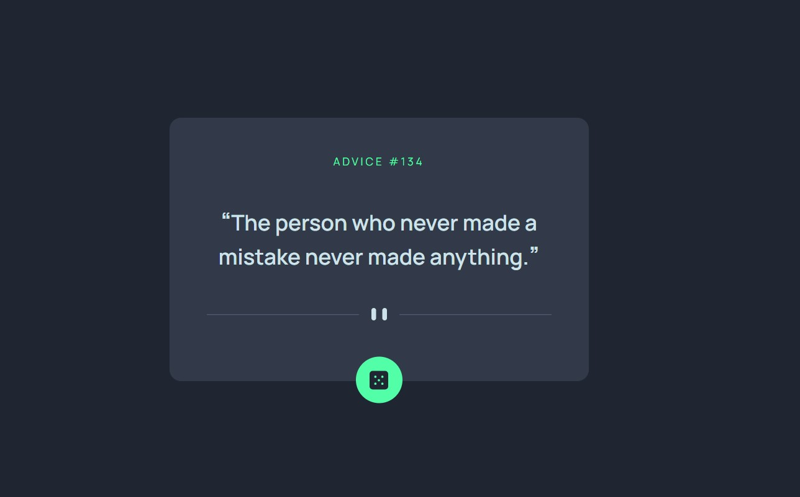

# Frontend Mentor - Advice generator app solution

This is a solution to the [Advice generator app challenge on Frontend Mentor](https://www.frontendmentor.io/challenges/advice-generator-app-QdUG-13db). Frontend Mentor challenges help you improve your coding skills by building realistic projects.

## Table of contents

- [Overview](#overview)
  - [The challenge](#the-challenge)
  - [Screenshot](#screenshot)
  - [Links](#links)
- [My process](#my-process)
  - [Built with](#built-with)
  - [What I learned](#what-i-learned)
  - [Continued development](#continued-development)
  - [Useful resources](#useful-resources)
- [Author](#author)
- [Acknowledgments](#acknowledgments)


## Overview

### The challenge

Users should be able to:

- View the optimal layout for the app depending on their device's screen size
- See hover states for all interactive elements on the page
- Generate a new piece of advice by clicking the dice icon

### Screenshot




### Links

- Solution URL: Pending
- Live Site URL: Pending

## My process

### Built with

- Semantic HTML5 markup
- CSS custom properties
- Flexbox
- [React](https://reactjs.org/) - JS library
- [Vite](https://vitejs.dev/) - Frontend dev tool


### What I learned

Learned a trick for triggering a useEffect which calls the fetch(API), on a button click event.

```js
  useEffect(() => {
    fetchData();
  }, [buttonclick]);

  const getAdvice = () => {
    setButtonclick((prevState) => prevState + 1);
    setError(null)
  };
```

With help of ChatGPT, created the snippet for handling the fetch(API), along with an "isLoading" state, boolean variable.

While the "isLoading" is true, a spinner is rendered, awaiting the response from the API. And the button is disabled as well. 

### Continued development


Continue improving my coding skills by developing challenging applications, like this one.

### Useful resources

- [Video tutorial](https://www.youtube.com/watch?v=BSBouqPx_Rk) - Got some key ideas from here.

- Also some key help from ChatGPT

## Author


- Website - [Guillermo Dominguez](https://gdominguez-portfolio.netlify.app)
- Frontend Mentor - [@memominguez](https://www.frontendmentor.io/profile/memominguez)


## Acknowledgments


Thanks to all those who share their knowledge, free of charge, through video tutorials in the youtube platform.

Thanks to the creators and sponsors of ChatGPT and similar resources.
 
